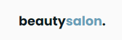
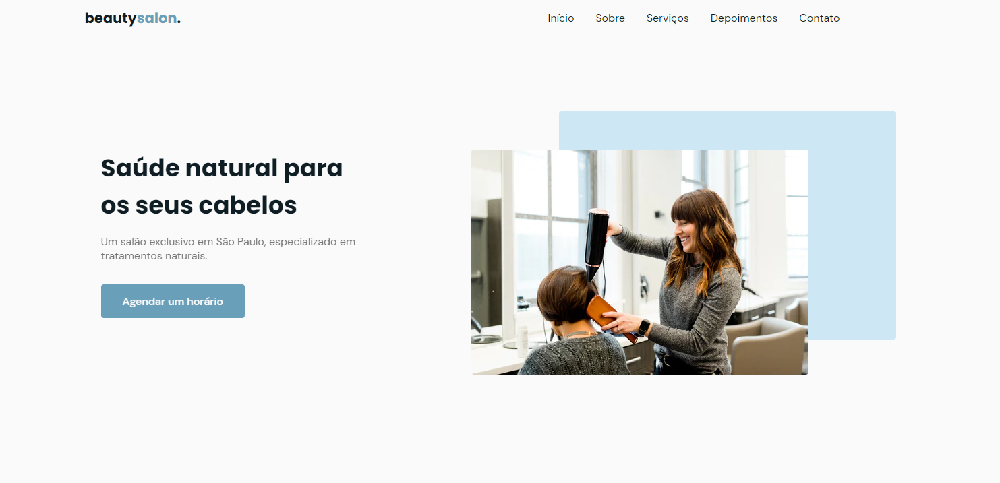

<p align="center">
  
</p>

 <div align="center">
  <!-- LICENSE -->
  
<!-- LAST COMMIT -->
<a href="https://github.com/marcelo-rafael/nlw-06-letmeask/commits/master">
    
  </a>
<!-- STARS -->
  <a href="https://github.com/marcelo-rafael/nlw-06-letmeask/stargazers/master">
    
  </a>
  <!-- FORKS -->
  <a href="https://github.com/marcelo-rafael/nlw-06-letmeask/forks/master">
    
  </a>
  <!-- AUTHOR -->
  
  <!-- LANGUAGES -->
   
  <!-- REPO SIZE -->
  
  <!-- CONTRIBUTORS -->
 
</div>

---

<h4 align="center">
🚧 NLW#6 - Trilha Origin - OriginSix 2.0 🚀 em construção... 🚧
</h4>

---

#### 🚀 Sobre o Projeto

O OriginSix é uma aplicação web de salão de cabeleireiros.

---

#### 🚀 O que é Next Level Week?

O [NLW](https://nextlevelweek.com/inscricao/6) é uma semana prática com muito código, desafios, network e com um único objetivo: levá-lo ao próximo nível.
Através do método da [Rocketseat](https://rocketseat.com.br/), você aprenderá novas ferramentas, tecnologias e descobrirá hacks que irão impulsionar sua carreira.
Um evento online e totalmente gratuito que o ajudará a dar o próximo passo na sua evolução como desenvolvedor.

---

#### 📋 Funcionalidades

  - [x] Sessão de home
  - [x] Sessão sobre
  - [x] Sessão de serviços
  - [x] Sessão de depoimentos
  - [x] Sessão de contacto
  - [x] Botão de agendamento para o WhatsApp.
  - [x] Ícones das redes sociais.
 
---


#### 🎨 Layout

O layout da aplicação está disponível no Figma:

<a href="https://www.figma.com/file/x2gNYqpuVmCZacAoPEeiuv/Origin-Six-(Copy)?node-id=0%3A1">
  
</a>

Design feito por [Rebecca Gonzalez](https://dribbble.com/rebeccagonzalez)

---

#### :computer:  Web

<h4 align="center">
  
  <p align="center">Tela inicial - OriginSix<p>
</h4>

---

#### 📱 Mobile

<h4 align="center">
  
  <p align="center">Tela inicial - OriginSix<p>
</h4>
---

#### :crossed_swords: Desafios para melhorar a aplicação
- [ ] Criar documentação
    - [ ] Gif de exemplo
    - [x] Readme-me incrível
    - [x] Tecnologias usadas
    - [x] Setup do projeto
    - [x] Funcionalidades
    - [ ] Screenshot das páginas
    - [ ] Adicionar favicon
 - [ ] Melhorar estilos
    - [ ] breakpoints - adaptar para outros dispositivos
    - [ ] Mobile First
    - [ ] Trocar cores, fontes e conteúdo


---

#### :gear: Tecnologias:

Este projeto foi desenvolvido utilizando as seguintes tecnologias:

- **[HTML]([Web/HTML](https://developer.mozilla.org/pt-BR/docs/Web/HTML))**
- **[CSS](https://developer.mozilla.org/pt-BR/docs/Web/CSS)**
- **[JavaScript](https://developer.mozilla.org/pt-BR/docs/Web/JavaScript)**
- **[swiper.js](https://swiperjs.com/)**
- **[scrollreveal](https://scrollrevealjs.org/)**


---

#### 🚀 Como executar o projeto

##### Pré-requisitos

Ter um editor para trabalhar com o código como [VSCode](https://code.visualstudio.com/)

---

#### 👯 Clonando o repositório

```bash
# Clone este repositório
$ git clone https://github.com/marcelo-rafael/nlw-06-originsix

# Acesse a pasta do projeto no terminal/cmd
$ cd nlw-06-originsix
```

#### 💪 Como contribuir para o projeto

1. 🍴 Faça um **fork** do projeto.
2. 👯 Clone esse repositório para sia máquina.
3. 🎋 Crie uma nova branch com as suas alterações: `git checkout -b my-feature`
4. ✅ Salve as alterações e crie uma mensagem de commit contando o que você fez: `git commit -m "feature: My new feature"`
5. 📌 Envie as suas alterações: `git push origin my-feature`
6. 🔃 Crie uma nova pull request

Depois que sua solicitação de pull request for mesclada, você pode excluir `your-feature`

> Caso tenha alguma dúvida confira este [guia de como contribuir no GitHub](https://github.com/firstcontributions/first-contributions)

---

##### 🤓 Autor


<div>
<a href="mailto:marcelo.rafael.goncalves@gmail.com">
      
   </a>
<a href="https://www.linkedin.com/in/marcelo-rafael-gonçalves/">
      
   </a>
<a href="https://github.com/marcelo-rafael">
  
  </a>
</div>
---

##### 📝 LICENÇA

Esse repositório está licenciado pela **MIT LICENSE**. Para mais informações detalhadas, leia o arquivo [LICENSE](./LICENSE) contido nesse repositório.

<h3 align="center">
Feito com ❤️ por <a href="https://www.linkedin.com/in/marcelo-rafael-goncalves/">Marcelo Rafael Gonçalves 💜🚀</a>
</h3>


